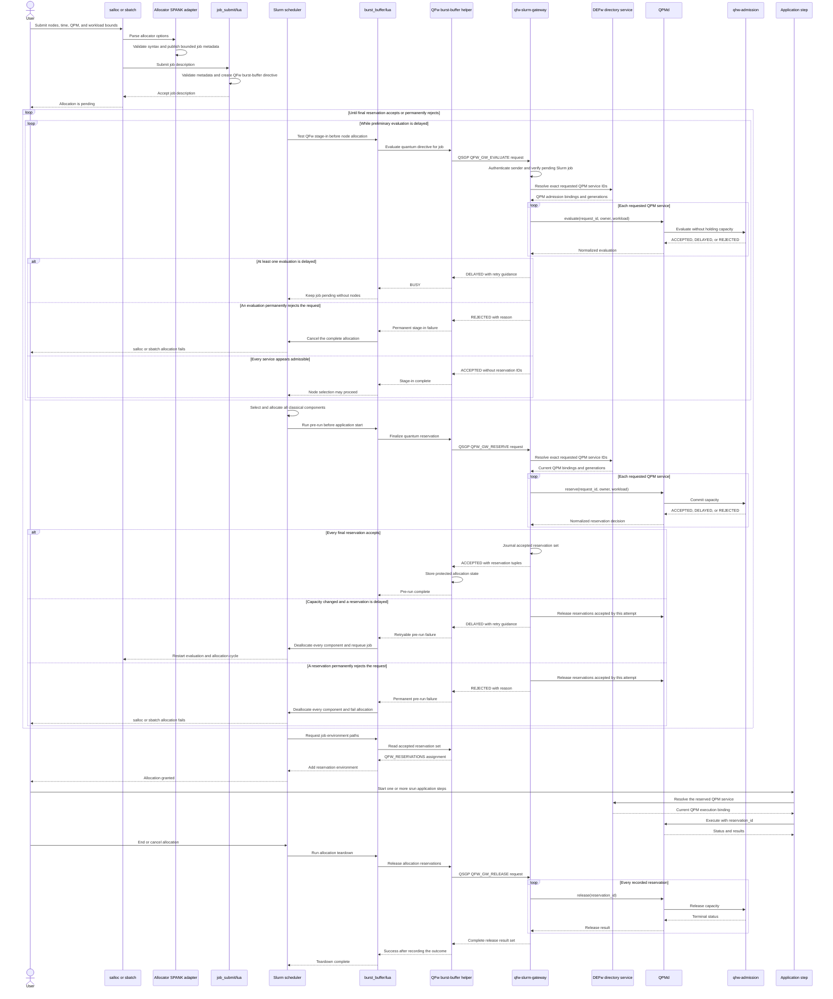

# Slurm Allocation Workflow for QFw Reservations

## Goal

The integration shall evaluate quantum eligibility and likely capacity while a
Slurm allocation is pending. It shall commit the quantum reservation only
after Slurm assigns the complete classical allocation and before any
application process starts.

Users describe the requested QPM services and bounded workload through
provider-neutral options on `salloc` or `sbatch`. The same interface supports
ordinary and heterogeneous allocations. `srun` starts application steps inside
an allocation that already owns its QPM reservations. It does not create,
extend, or release those reservations.

QPMd and qhw-admission remain authoritative for quantum capacity. A QPM may
accept several Slurm allocations when its configured admission policy permits
sharing. Slurm node exclusivity, GRES counts, HRES counts, and partition
membership do not replace QPM admission.

The completed workflow has the following properties.

- A delayed preliminary evaluation leaves the Slurm allocation pending without
  holding quantum capacity or classical nodes.
- A delayed final reservation releases the newly assigned classical nodes and
  requeues the complete Slurm allocation.
- A permanent QPM rejection fails the complete Slurm allocation.
- An accepted decision produces one reservation tuple per requested QPM.
- Every application step receives the same accepted reservation set.
- Allocation completion or cancellation causes one best-effort release.
- The gateway performs at most one evaluation per requested QPM for each Slurm
  poll and one final reservation attempt after node assignment. Slurm owns
  evaluation polling and requeue behavior.

This is an optimistic, two-phase stop-gap rather than an atomic transaction
between Slurm and QPMd. `QFW_GW_EVALUATE` is deliberately non-binding. It
checks whether a request is valid and appears admissible without consuming or
holding QPM capacity. `QFW_GW_RESERVE` remains the only operation that commits
capacity and creates reservation IDs.

This repository is preparing its first release. Migration does not preserve
the existing step-time reservation workflow as a compatibility path. Once the
allocation-time path passes its acceptance tests, the replaced callbacks,
configuration, epilog workflow, tests, and documentation are removed.

## Desired Workflow



## User-Facing Allocation Contract

The allocator SPANK adapter registers these options for `salloc` and `sbatch`.

```text
--qpu=service[,service]
--workload-kind=quantum|hybrid
--circ-count=count
--max-qubits=count
--max-depth=count
--max-shots=count
--max-one-q-gates=count
--max-two-q-gates=count
--max-measurements=count
```

`--circ-count`, `--max-qubits`, `--max-depth`, and `--max-shots` are required
for a managed request. Slurm supplies the job owner, account, QoS, priority,
walltime, allocation identity, and heterogeneous component identity.

The options are allocation properties. The SPANK adapter registers them only
in `S_CTX_ALLOCATOR`. The `srun` client uses `S_CTX_LOCAL`, so the options are
not registered there. An attempt to pass a quantum option to `srun` fails as an
unknown option. Application steps inherit the reservation created for their
allocation.

A site may use partitions to constrain which users and nodes participate in a
quantum workflow. Root-owned qfw-slurm configuration may also associate a
partition with permitted or default QPM service IDs. Partition membership does
not represent QPM capacity. The admission decision still comes from QPMd.

The QPM host does not have to belong to the application allocation. A site that
places an IQM service host in a Slurm partition may choose whether applications
also allocate that host. Requiring the host as an exclusive node would reduce
QPM sharing below the capacity allowed by qhw-admission.

## Component Responsibilities

| Component | Responsibility | Excluded responsibility |
| --- | --- | --- |
| Allocator SPANK adapter | Register and validate user-facing options, then let Slurm copy them into `spank_job_env` | Directory lookup, gateway communication, reservation, release, and application environment mutation |
| `job_submit/lua` | Read trusted SPANK option metadata, apply static site policy, and construct the internal burst-buffer directive | Network I/O or QPM admission while slurmctld locks are held |
| `burst_buffer/lua` | Connect Slurm's pending, begin, cancel, completion, and teardown states to small qfw-slurm helpers | QPM selection or admission policy |
| Burst-buffer helper | Parse the internal directive, issue one evaluation per Slurm poll, issue one final reservation attempt during pre-run, maintain protected Slurm-side state, and translate each result into a burst-buffer status | Autonomous polling or capacity decisions |
| Gateway | Authenticate the Slurm service, verify the Slurm job, resolve exact services, forward QPM calls, and journal terminal outcomes | Polling, provider selection, or independent scheduling |
| QPMd | Evaluate requests without holding capacity, commit final reservations, validate entitlement and credentials, invoke qhw-admission, own reservation IDs, and authorize execution | Slurm node scheduling |
| QFw application backend | Parse `QFW_RESERVATIONS`, resolve the selected service through the directory, and attach the reservation ID to execution calls | Creating or releasing the allocation reservation |

## Source-Validated Slurm Mechanisms

This design targets `slurm-25-05-0-1`, the version selected by the virtual
cluster. The following behavior was verified in that tag and in the Slurm
development branch available during design.

| Slurm source | Verified behavior |
| --- | --- |
| `src/common/spank.c` and `src/common/slurm_opt.c` | Allocator SPANK options become `_SLURM_SPANK_OPTION_*` entries in `job_desc.spank_job_env`. |
| `src/plugins/job_submit/lua/job_submit_lua.c` | Lua can read `spank_job_env` and assign `job_desc.burst_buffer`. |
| `src/interfaces/job_submit.c` | Job-submit callbacks execute while controller configuration, job, node, and partition read locks are held. |
| `src/slurmctld/job_mgr.c` | Job-submit processing precedes burst-buffer validation and creation of the persistent job record. |
| `src/slurmctld/node_scheduler.c` | `bb_g_job_test_stage_in()` completes before `allocate_nodes()` commits compute nodes. |
| `src/plugins/burst_buffer/lua/burst_buffer_lua.c` | `SLURM_BB_BUSY` causes bounded-interval polling; pre-run executes after node assignment; a pre-run failure can deallocate nodes and requeue the job; completion and cancellation queue teardown. The paths callback runs before asynchronous pre-run and therefore cannot export a reservation created by pre-run. |
| `src/common/env.c` | Burst-buffer environment is unqualified for ordinary allocations and receives `HET_GROUP_N` and `PACK_GROUP_N` suffixes for heterogeneous allocations. |
| `src/interfaces/burst_buffer.c` | Slurm permits only one configured burst-buffer provider. |

The same source shows that a permanent stage-in failure holds the job rather
than cancelling it. The desired cancellation behavior therefore requires an
additional, explicitly tested controller action.

## Slurm Integration

### Allocator option transfer

Slurm calls allocator SPANK initialization from both `salloc` and `sbatch`.
After option parsing, Slurm converts each registered option into a bounded
`_SLURM_SPANK_OPTION_*` entry and copies it into `job_desc.spank_job_env`.

The revised SPANK module performs no gateway initialization. Local and remote
SPANK contexts return without registering quantum options or performing QSGP
operations. This removes reservation work from `srun` and `slurmstepd`.

### Job-submit translation

The job-submit Lua plugin reads `job_desc.spank_job_env`. It rejects malformed,
partial, duplicate, or conflicting quantum options. Root-owned policy maps the
user-facing QPM names and optional partition defaults to exact QPM service IDs.

The plugin writes one deterministic internal directive into
`job_desc.burst_buffer`. The directive contains only bounded identifiers and
workload scalars. It carries no credential, reservation ID, arbitrary shell
text, or user-selected identity.

The job-submit callback performs parsing and local policy checks only. Slurm
calls it while controller configuration, job, node, and partition read locks
are held. Directory, gateway, and QPM calls occur during asynchronous
burst-buffer stage-in instead.

### QSGP operation contract

QSGP adds the `QFW_GW_EVALUATE` command for this stop-gap workflow. It is a
separate typed request and response operation rather than a mode bit on the
existing reserve request.

| Operation | Effect on QPM capacity | Successful response |
| --- | --- | --- |
| `QFW_GW_EVALUATE` | None. It validates entitlement, request bounds, service availability, and the current admission estimate. | `ACCEPTED` means that node selection may proceed, but returns no reservation ID and promises no future capacity. |
| `QFW_GW_RESERVE` | Commits capacity through qhw-admission. | `ACCEPTED` returns the service and reservation tuples exported to the application. |
| `QFW_GW_RELEASE` | Releases previously committed reservations. | Returns a terminal result for each supplied reservation tuple. |

The evaluate request carries the same trusted job identity, requested service
IDs, workload bounds, request ID, and fingerprint used by the later reserve
request. Its response carries the normalized admission decision, reason,
diagnostic, estimated timing, and retry guidance, but it cannot carry an
accepted reservation ID. The later reserve request is a new operation for the
same allocation attempt. Its idempotency key is stable across transport retries
but changes after Slurm requeues the job for another evaluate-and-reserve
cycle.

`QFW_GW_EVALUATE` does not create a lease, queue position, capacity hold, or
claim on a future admission decision. Adding any of those guarantees would
turn evaluation into a reservation and reproduce the resource-holding problem
this workflow is intended to avoid.

The gateway implements the command by invoking the existing QPM admission
`evaluate()` method. QPMd already separates that dry-run path from `reserve()`,
so the new operation extends QSGP and qfw-slurm without inventing another QPM
admission primitive.

The QPM admission C contract uses zero as the no-reservation sentinel in an
evaluation decision. The gateway normalizes zero to an absent identifier and
rejects any nonzero reservation ID returned by evaluation.

### Preliminary evaluation stage-in

The Lua burst-buffer implementation starts stage-in before committing compute
nodes. Its configured `slurm_bb_test_data_in` function invokes the qfw-slurm
helper once per Slurm poll.

The helper constructs a QSGP `QFW_GW_EVALUATE` request from the internal
directive and authoritative job identity. The same logical evaluation request
ID and fingerprint are used on every poll. Each network exchange may use a
different correlation ID.

The response mapping is fixed.

| QPM result | Gateway state | Burst-buffer result | Slurm result |
| --- | --- | --- | --- |
| `DELAYED` | Nonterminal attempt | `slurm.SUCCESS, slurm.SLURM_BB_BUSY` | Job remains pending and is polled again |
| `ACCEPTED` | Non-binding positive evaluation | `slurm.SUCCESS` | Stage-in completes and node selection may proceed |
| `REJECTED` | Terminal rejection | Permanent error plus allocation cancellation | No nodes are allocated and the allocation command fails |
| Transport or gateway error | Operational failure | Error governed by bounded retry policy | Job remains pending or fails according to site policy |

Slurm owns the poll loop. The gateway does not sleep, schedule a retry, or run
a background admission worker. A repeated delayed request causes one new QPM
evaluation call. No evaluation outcome has a reservation ID or commits
capacity, so reevaluation is safe.

An accepted evaluation permits scheduling but does not create accepted
reservation state. A permanent evaluation rejection is terminal for the Slurm
allocation. A reused request ID with a different fingerprint remains a
conflict.

When several QPMs are requested, one evaluation covers the complete set. An
`ACCEPTED` response is returned only when every requested service evaluates as
admissible. There is nothing to roll back because evaluation holds no capacity.

### Final reservation during pre-run

After Slurm assigns every classical component, `slurm_bb_pre_run` invokes the
helper once with `QFW_GW_RESERVE`. This is the first operation that may commit
QPM capacity. The application remains blocked until the complete multi-service
reservation succeeds.

If every service accepts, the gateway journals the tuple set before returning
it and the helper atomically records the accepted allocation state. Repeating
the same final request after a lost response returns that stored tuple set
instead of creating another reservation.

If any service is delayed because capacity changed after evaluation, the
gateway releases reservations accepted during the partial attempt. The helper
returns a retryable pre-run failure. Slurm deallocates every component of the
job and requeues it at the preliminary evaluation stage. The helper and
gateway do not poll while classical nodes are assigned.

A permanent reserve rejection also rolls back a partial multi-service attempt,
but it fails the complete allocation rather than requeueing it. Requeue is
bounded and uses Slurm backoff. Exhausting the configured attempt limit holds
or fails the job according to explicit site policy instead of cycling forever.

### Permanent rejection

Slurm's generic burst-buffer failure path places a job on hold. That behavior
does not satisfy the allocation contract because an interactive `salloc` could
continue waiting on a job that can never run.

The qfw-slurm integration therefore needs a controller-safe rejection path.
It records the QPM reason, completes rollback, and cancels the pending Slurm
allocation. The implementation must validate that cancellation from the
asynchronous burst-buffer helper does not deadlock slurmctld and causes both
`salloc` and `sbatch` to observe a terminal failure. If the stock Lua interface
cannot provide that behavior safely, a minimal controller adapter is required.
Network access is not moved into `job_submit/lua` as a workaround.

The pre-run path must distinguish a retryable `DELAYED` result from a permanent
`REJECTED` result. The former uses Slurm's requeue behavior after deallocating
the complete job. The latter must bypass further requeue attempts and terminate
the allocation after rollback.

### Accepted reservation state

The helper stores the accepted tuple set in a SlurmUser-owned state directory.
The record is keyed by cluster and canonical allocation ID. It includes the
service IDs, reservation IDs, trusted allocation identity, request identity,
attempt count, and lifecycle state. QPM runtime identities and generations
remain in the gateway journal rather than being duplicated in Slurm state.

Permissions prevent allocation users from changing the record. The record
contains no provider credential. Atomic replacement prevents a remote
slurmstepd from reading a partial file.

In Slurm 25.05, `slurm_bb_paths` runs before the asynchronous pre-run helper,
so it cannot export the reservation created during pre-run. The remote SPANK
callback therefore has one read-only responsibility. It reads the protected
environment record after pre-run and injects `QFW_RESERVATIONS` into each
application step. It does not contact the gateway, create a reservation, or
change lifecycle state.

### Normal and heterogeneous environments

For an ordinary allocation, Slurm carries the supplemental environment into
the allocation shell as plain `QFW_RESERVATIONS`.

For a heterogeneous allocation, the quantum options belong to the component
that runs the QFw application. The helper writes protected aliases for both
the canonical heterogeneous job ID and that component job ID. A remote step
uses its authoritative Slurm job ID to read the matching alias and receives
plain `QFW_RESERVATIONS` through `spank_setenv()`.

Components without a matching accepted record receive no reservation context.
The QPM host does not require a heterogeneous component because it is a
site-owned service outside the application allocation. This keeps all changes
inside qfw-slurm and preserves the existing `qfw-srun --het-group` interface.

## Release and Teardown

Allocation termination, cancellation, and failed pre-run all enter the
burst-buffer teardown path. A job that completed only evaluation has no
reservation to release. When accepted reservation state exists, the helper
sends one QSGP `QFW_GW_RELEASE` request. The gateway attempts every recorded
reservation even when one QPM returns an unresolved status.

Release is best effort from Slurm's perspective. The helper records the
response and returns success to `burst_buffer/lua` even when the gateway or a
QPM reports a release failure. Slurm therefore completes allocation teardown
without entering its bounded burst-buffer retry loop.

QPM release is idempotent. An already released reservation is successful.
Failure to deliver the request can leave capacity active in QPMd, so the
gateway journal and logs preserve the unresolved result. This release treats
successful delivery as an operational assumption for the first release.
Reservation expiration remains the eventual safety mechanism and must be
validated separately before it is claimed as guaranteed cleanup.

The existing `EpilogSlurmctld` release executable becomes unnecessary after
burst-buffer teardown owns allocation release. It is removed with the remote
SPANK reservation path after equivalent cancellation and shutdown tests pass.

## Gateway State Changes

The QSGP evaluate, reserve, and release messages are synchronous.
`QFW_GW_EVALUATE` is not a gateway-owned polling operation. Each call performs
one QPM evaluation and returns its result to Slurm.

The gateway allocation state machine changes as follows.

```text
new
  -> evaluating
  -> evaluation-delayed -> evaluating -> ...
  -> evaluation-accepted
       -> reserving
       -> reservation-delayed -> requeued -> evaluating
       -> reservation-accepted -> releasing -> released
       -> reservation-rejected
  -> evaluation-rejected
  -> rollback-pending
```

`evaluation-delayed` is nonterminal. The operation journal retains its
fingerprint and diagnostics but permits the next identical evaluate request to
call QPMd again. `evaluation-accepted` permits node selection but holds no
capacity. A delayed final reservation transitions the allocation to requeue
after partial rollback. `reservation-accepted` and rejection outcomes are
terminal for their operation IDs. Repeating an accepted reserve request returns
the stored tuple set.

For a multi-service attempt, accepted services are temporary until the full
set accepts. Delay, rejection, or operational failure initiates rollback.
Incomplete rollback remains visible in the journal even though no partial set
is returned to Slurm as accepted.

## Migration from the Existing Implementation

The repository already provides reusable pieces that remain valid.

- QSGP framing, bounded TLVs, network byte order, and MUNGE protection
- The native synchronous gateway client
- Typed reserve and release requests and responses, extended with the new
  evaluate operation
- Gateway authentication and Slurm job verification
- DEFw directory lookup and exact QPM service resolution
- Multi-service reserve rollback and release traversal
- SQLite request and allocation journaling
- The standalone lifecycle driver and deterministic gateway tests

The existing Slurm adapter performs reservation in remote
`slurm_spank_init_post_opt`, immediately before a task starts. It exports
`QFW_RESERVATIONS` with `spank_setenv`, defers launch errors to
`slurm_spank_task_init`, and uses `EpilogSlurmctld` for release. These parts are
replaced rather than retained as an alternate workflow.

| Existing behavior | Target behavior |
| --- | --- |
| Options registered in allocator, local, and remote contexts | Options registered only for allocation submission |
| Gateway client initialized by every SPANK context | Gateway client used by the burst-buffer helper |
| First `srun` step reserves the QPM | Pending stage-in evaluates; pre-run reserves after node assignment |
| Delayed admission denies a task launch | Delayed evaluation returns `BUSY`; delayed final reservation deallocates and requeues |
| Remote SPANK reserves and exports | Remote SPANK only reads protected accepted state and exports it; pre-run owns reservation |
| Task initialization reports permanent rejection | Evaluation rejection fails before node assignment; final rejection deallocates nodes and fails the allocation |
| Controller epilog releases reservations | Burst-buffer teardown performs best-effort release |
| Gateway journals delayed reserve as `not-accepted` | Delayed evaluation is polled; delayed final reservation triggers rollback and a new Slurm allocation cycle |

## Implementation Sequence

### Step 1. Preserve a verified baseline

Add tests that describe the existing native option parser, QSGP client,
gateway verification, multi-service transaction, journal, and driver behavior.
Record the current Slurm cluster version and the exact `burst_buffer/lua`
callbacks available in that version.

Exit criteria include a clean native build, gateway unit tests, deterministic
driver tests, and an installed-tree smoke test.

### Step 2. Define internal allocation metadata

Define the bounded names used between allocator SPANK and `job_submit/lua`.
Define the internal burst-buffer directive grammar, maximum size, required
fields, canonical ordering, and escaping rules. Add parsers that reject
unknown required fields, duplicates, truncation, and inconsistent values.

The grammar is internal to qfw-slurm. Users continue to supply separate command
options rather than a packed request string.

### Step 3. Restrict SPANK to allocation submission

Refactor `spank_quantum.c` so `S_CTX_ALLOCATOR` owns option registration and
validation. Remove gateway configuration, QSGP connections, remote job lookup,
reservation processing, `spank_setenv`, deferred task failure, and remote
option callbacks.

Add tests for `salloc` and `sbatch` option acceptance. Verify that `srun`
rejects the quantum options and that ordinary `srun` steps remain unaffected.

### Step 4. Add job-submit translation

Install a qfw-slurm job-submit Lua module. It reads only the qfw-slurm SPANK
metadata, applies root-owned resource and partition mappings, and writes the
canonical burst-buffer directive.

Unit tests cover normal and heterogeneous descriptions, partition defaults,
multiple QPM services, missing fields, malformed numbers, and conflicting
configuration. A timing test confirms that the callback performs no external
I/O.

### Step 5. Add the private burst-buffer helper

Create one private native executable or subcommand for evaluate, reserve, state
lookup, environment rendering, and release. Reuse the existing native option,
operation, QSGP, deadline, and MUNGE code. The helper must not duplicate QSGP
encoding or response validation.

State paths, ownership, modes, atomic writes, size limits, and cleanup rules
become installed configuration. Unit tests run without Slurm by supplying
fixture job metadata and a deterministic gateway.

### Step 6. Add the QSGP evaluation operation

Add the typed `QFW_GW_EVALUATE` request and response to the protocol, native
client, gateway dispatcher, driver, and protocol tests. The gateway forwards
the request through QPMd's existing `evaluate()` admission method. Reuse the
reserve request's identity and workload structures without overloading
`QFW_GW_RESERVE`. Reject any evaluation response containing a reservation ID.

Change delayed evaluation records from terminal to nonterminal. An identical
request following a delay calls QPMd again. Accepted evaluation permits node
selection but creates no allocation reservation. Rejected evaluation remains
terminal. Conflicting fingerprints fail.

Tests cover delayed-to-delayed, delayed-to-accepted, delayed-to-rejected,
accepted and rejected replay, malformed evaluation responses, and concurrent
polls for the same allocation.

### Step 7. Implement burst-buffer evaluation hooks

Install the Lua functions required by `burst_buffer/lua`. Setup validates local
state. Data-in prepares the attempt. Test-data-in calls
`QFW_GW_EVALUATE` once per Slurm poll and maps delayed to `BUSY`. Real-size
reports no capacity because QPMd owns quantum accounting.

An accepted evaluation records only the request identity and diagnostic state
needed for pre-run. Repeated stage-in calls do not create a reservation.

### Step 8. Reserve during pre-run and requeue on contention

Implement one synchronous `QFW_GW_RESERVE` call from `slurm_bb_pre_run` after
all classical components are assigned. Journal an accepted response before
returning it and atomically write the reservation tuple set before permitting
the application to start.

Map a delayed final decision to partial rollback, deallocation of every normal
or heterogeneous component, and Slurm requeue. The next cycle begins with a
new evaluation attempt. Use bounded retry and backoff; never poll QPMd while
classical nodes remain assigned. Test that a lost accepted response replays the
same reservation instead of creating another one.

### Step 9. Implement rejection-to-allocation failure

Prototype cancellation from the asynchronous stage-in execution context and
failure from the pre-run context. Confirm through Slurm source tracing and live
cluster tests that no controller lock is held across a cancellation RPC.

One test rejects during evaluation. It must exit with a nonzero status,
allocate no nodes, retain the reason in Slurm diagnostics, and leave no QPM
reservation. A second test rejects during final reserve. It must release every
classical component, roll back any partial QPM set, and fail rather than
requeue. A held pending job does not satisfy either test.

### Step 10. Export accepted reservations

Because Slurm 25.05 calls `slurm_bb_paths` before pre-run, keep that hook free
of reservation export. Restrict remote SPANK to reading the protected accepted
record and calling `spank_setenv()` for application steps. It must make no
gateway call and must not create, release, or alter a reservation.

For ordinary allocations, verify that every later step receives the same
canonical `QFW_RESERVATIONS` value. Test the application component in group
zero and a nonzero group. A component without the protected alias receives no
reservation context.

### Step 11. Implement best-effort teardown

Map normal completion, cancellation after final acceptance, and partial pre-run
failure to the same release operation. Evaluation-only jobs have no
reservation to release. The gateway visits every committed reservation. The
helper records all outcomes and returns success to Slurm.

Tests cover already-terminal reservations, missing QPM registrations, gateway
unavailability, partial release, repeated teardown, and slurmctld restart.
They verify that Slurm finishes teardown in every case.

### Step 12. Remove the superseded workflow

Delete remote and local SPANK reservation behavior, task-init launch denial,
the controller epilog release path, their configuration keys, and their tests.
Retain only the remote read-only accepted-state injection required by the
Slurm 25.05 callback ordering.
Update the standalone driver so it remains a diagnostic of the common QSGP and
gateway operations rather than a model of Slurm callback placement.

No compatibility wrapper or deprecated option mode remains.

### Step 13. Package the Slurm configuration

Install the allocator SPANK module, job-submit Lua module, burst-buffer Lua
module, private helper, gateway, service unit, root-owned mappings, manual
pages, and example configuration.

Document the single-provider limitation of Slurm's burst-buffer interface. A
site already using another `BurstBufferType`, including DataWarp, needs a
combined provider or a different controller integration.

### Step 14. Validate on the virtual cluster

Build a fresh cluster image from committed sources. Run the following cases as
non-root users while QPMd and the gateway remain root- or service-owned.

1. An ordinary allocation whose evaluation and final NWQSim reservation accept
2. A delayed evaluation that later accepts without holding nodes or QPM capacity
3. A final reservation that delays, releases its assigned nodes, requeues, and later accepts
4. A permanently rejected evaluation
5. A permanently rejected final reservation
6. A heterogeneous allocation with the application in group zero
7. A heterogeneous allocation with an explicitly selected application group
8. A request for multiple QPM services, including partial final rollback
9. Several `srun` steps reusing one reservation set
10. Two concurrent allocations accepted by a shared QPM policy
11. Cancellation while evaluation is delayed
12. Cancellation and normal completion after final acceptance
13. Gateway loss during evaluation, reserve, and release
14. Exhaustion of the final-reservation requeue limit
15. A short, explicitly authorized real-IQM application

During delayed evaluation, `squeue` must show no allocated classical nodes and
QPM accounting must show no reservation. A delayed final reserve may briefly
place nodes in configuring state, but all components must be deallocated before
the job returns to pending. QPM accounting must show at most one reservation
per service and Slurm allocation. Teardown must leave Slurm terminal even when
release is reported as unresolved.

## Known Constraints

The burst-buffer interface permits only one configured provider. This design
cannot be installed beside an independent DataWarp burst-buffer plugin without
combining their behavior.

HRES in Slurm 25.05 provides beta, statically configured, license-like
hierarchical capacity. It has no external qhw-admission callback. HRES may
describe static site limits, but it does not replace this admission workflow.

Preliminary acceptance does not guarantee final admission. Several jobs can
evaluate successfully, receive classical allocations, and then compete for
the same QPM capacity. A loser deallocates its nodes and requeues. This can
produce scheduling churn or starvation, so requeue attempts and backoff are
bounded and observable.

Classical nodes remain assigned during the single final reservation exchange.
The helper must not poll, sleep until quantum capacity changes, or leave the
job configuring indefinitely. The QPM reservation becomes active only after
the classical allocation exists and immediately before application start, so
its normal lease covers execution rather than the classical scheduling wait.

The gateway and QPM do not participate in one atomic transaction with
slurmctld. Stable request IDs, accepted-response journaling, idempotent release,
rollback, and expiration reduce the failure window. They do not provide a
distributed transaction.

## Completion Criteria

The migration is complete when all of the following statements hold.

- `salloc` and `sbatch` accept the documented quantum options.
- `srun` cannot create or modify a QPM reservation.
- Slurm allocates no classical nodes while preliminary evaluation is delayed.
- Every Slurm poll produces at most one corresponding gateway/QPM evaluation.
- `QFW_GW_EVALUATE` never creates a reservation ID or consumes QPM capacity.
- Slurm performs exactly one final reservation attempt per allocation cycle
  while nodes are assigned.
- A delayed final reservation deallocates all components before requeueing.
- Accepted allocations expose one canonical reservation tuple per QPM.
- Permanent rejection terminates the complete Slurm allocation.
- Normal and heterogeneous applications receive usable reservation context.
- Repeated application steps do not create additional reservations.
- Cancellation and completion attempt release exactly once per lifecycle.
- Teardown completes from Slurm's perspective even when release is unresolved.
- Accepted reservations remain valid for the complete application lifetime.
- Remote SPANK performs no reservation operation and the controller-epilog
  workflow is absent.
- The complete simulator matrix and guarded real-IQM smoke test pass on a
  freshly built Slurm cluster.
