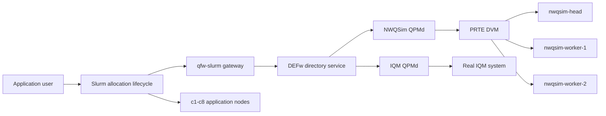

# Slurm Integration Decisions — September 4, 2026

## Purpose

This record captures the agreed direction for persistent QPM services in the
QFw virtual Slurm cluster, the `qfw-sinfo` and `qfw-squeue` commands, and the
long-term role of the qfw-slurm repository. It separates the intended stable
Slurm integration from the gateway used by the first release.

## Target topology

The virtual cluster will retain c1 through c8 as application nodes and add four
dedicated service nodes:

- `nwqsim-head`, which hosts the NWQSim QPMd and PRTE DVM master.
- `nwqsim-worker-1` and `nwqsim-worker-2`, which join the NWQSim DVM.
- `iqm-head`, which hosts the QPMd that communicates with the real IQM system.

The directory service and the current qfw-slurm gateway run on `slurmctld`.
All four service nodes run `slurmd` and appear in a visible, administrator-only
`qfw-services` partition. Ordinary applications run on c1 through c8 and do not
allocate the service nodes.



## Decisions

### Service nodes are visible but not application resources

The service nodes will be present in `slurm.conf` and will run `slurmd` so that
Slurm can report their host health and static roles. The `qfw-services`
partition will be visible through `sinfo`, but submission to that partition
will be restricted to administrators.

Node names and features will identify their roles. A representative view is:

```text
NODE                 FEATURES
nwqsim-head          qfw-service,nwqsim,qpm,dvm-head
nwqsim-worker-1      qfw-service,nwqsim,dvm-worker
nwqsim-worker-2      qfw-service,nwqsim,dvm-worker
iqm-head             qfw-service,iqm,qpm
```

Application jobs do not acquire these nodes. They acquire classical nodes and
separate QPM reservations. This preserves the qhw-admission model, in which
several applications may hold independent capacity or credit allocations on a
single QPMd.

Slurm node state reports the service host, not QPM capacity. A service node can
remain Slurm `IDLE` while its QPMd has active reservations.

### Site services have an explicit lifecycle

An administrator command will start, inspect, and stop the site service plane.
Startup proceeds in dependency order:

1. Start the directory service on `slurmctld`.
2. Start one PRTE DVM across all three NWQSim nodes.
3. Start the NWQSim QPMd on `nwqsim-head` and assign all three DVM hosts.
4. Start the real-IQM QPMd on `iqm-head`.
5. Wait for both QPM services to register and report readiness.
6. Verify that the qfw-slurm gateway can reach the directory service.

The lifecycle command must preserve existing IQM access and credential files.
It must not print, copy, replace, or weaken the permissions of protected
credential material.

### Slurm reserves logical QPM capacity

Slurm learns about a requested QPM through the qfw-slurm job-submit and
burst-buffer lifecycle. The gateway discovers the requested service and calls
QPM evaluation, reservation, and release APIs. Slurm does not infer QPM
availability from the state of the node hosting QPMd.

This separation allows multiple hybrid jobs to use the same long-running QPMd
when its admission policy permits it.

### qfw-sinfo and qfw-squeue are permanent qfw-slurm commands

The commands will be implemented and packaged by qfw-slurm because they
provide Slurm-oriented views. Their placement does not require them to use the
gateway.

Both commands run as DEFw client processes. They connect to the configured
directory service, discover QPM services, call read-only QPM APIs, and combine
the results with Slurm JSON output.

```text
qfw-sinfo
    +-- sinfo --json
    +-- DEFw -> directory service -> QPM status APIs

qfw-squeue
    +-- squeue --json
    +-- DEFw -> directory service -> QPM reservation-status APIs
```

The gateway remains dedicated to Slurm lifecycle requests. Interactive status
commands do not route read-only inspection through it.

### qfw-sinfo presents host and service state separately

The default output will follow the compact style of `sinfo` while showing both
Slurm host state and QPM service state:

```text
NODE             SERVICE       BACKEND  STATE  ACTIVE  SLURM_STATE
nwqsim-head      nwqsim        NWQSim   BUSY   2       IDLE
nwqsim-worker-1  nwqsim        NWQSim   BUSY   2       IDLE
nwqsim-worker-2  nwqsim        NWQSim   BUSY   2       IDLE
iqm-head         iqm-ornl-20q  IQM      IDLE   0       IDLE
```

The initial QPM state meanings are:

- `IDLE`: registered and ready with no active reservations.
- `BUSY`: registered and ready with at least one active reservation.
- `DOWN`: unregistered, unreachable, or not ready.
- `MAINT`: administratively unavailable, when maintenance state is supported.

`BUSY` does not mean that admission is closed. The QPM may accept more work,
depending on the requested workload and admission policy. The `ACTIVE` column
reports the number of active reservations to avoid implying node-style
exclusivity.

The command accepts an optional node name:

```bash
qfw-sinfo nwqsim-head
qfw-sinfo nwqsim-worker-1
qfw-sinfo iqm-head
qfw-sinfo --json
```

For a DVM worker, the directory and QPM assignment data identify the QPM that
owns the worker. A detailed query can then report its service ID, runtime ID,
generation, active counts, assigned hosts, and DVM readiness.

### qfw-squeue correlates Slurm jobs with sanitized QPM state

`qfw-squeue` combines `squeue --json` with QPM reservation status. Its default
view will resemble:

```text
JOBID USER   STATE   NODES  QPU            QSTATE
41    user-a RUNNING c1     nwqsim         ACTIVE
42    user-b PENDING -      iqm-ornl-20q   EVALUATING
```

QPM reservations must retain the originating scheduler type, cluster name,
and canonical Slurm allocation ID. This allows the command to correlate a
Slurm job with QPM state without reading the gateway journal.

Read-only status APIs must not expose provider credentials, application
authorization material, or reservation identifiers belonging to other users.
Until caller authentication is implemented, the default interface returns
only information already visible through Slurm plus sanitized state and
aggregate counts.

### qfw-slurm remains after the gateway is retired

qfw-slurm is the permanent home of Slurm integration, including allocator
options, lifecycle plugins, inspection commands, Slurm-version packaging, and
system tests.

The first-release gateway is a temporary language bridge:

```text
Current:
Slurm plugin -> QSGP -> gateway -> Python DEFw -> directory/QPMd

Target:
Slurm plugin -> native DEFw/QFw client -> directory/QPMd
```

When DEFw provides stable native C directory and QPM interfaces, qfw-slurm
will replace the gateway path with updated native Slurm plugins. The gateway,
QSGP socket path, gateway journal, and gateway-specific MUNGE exchange can then
be removed. User-facing Slurm options and `qfw-sinfo`/`qfw-squeue` behavior
should remain stable across that transition.

### Native transition contract

The later native client must preserve the current lifecycle boundary. It
initializes from the installed site configuration, joins the DEFw directory,
and resolves QPMs by exact service ID. Direct QPM endpoint configuration is not
part of the contract. Each resolved binding carries the QPM runtime ID and
directory generation so that a restarted service invalidates stale work.

The native interface must expose the QPM evaluation, reservation, reservation
lookup, and release operations required by the Slurm lifecycle. It must retain
the canonical allocation identity, request UUID, requested service IDs, and
workload limits already carried by QSGP. Operations remain synchronous from
the plugin's perspective and have administrator-configured bounded timeouts.

Identity is established from Slurm's trusted controller context and the
authenticated native DEFw connection. A username or allocation ID supplied by
an untrusted application payload is never authoritative. MUNGE remains the
cluster identity mechanism unless the native DEFw transport supplies an
equivalent authenticated peer identity.

Retries preserve the current idempotency rules. Repeating evaluation does not
hold capacity. Repeating reservation with one request UUID returns the same
outcome, and repeating release is successful after the reservation is already
terminal. Errors distinguish retryable delay or temporary transport failure
from permanent rejection and malformed input. The gateway path is removed
only after the native implementation passes the same lifecycle and cluster
acceptance tests.

## Repository ownership

| Repository | Ownership |
| --- | --- |
| QFw-SLURM-Cluster | Service containers, Slurm nodes and partition, administrative lifecycle command, site configuration, protected credential provisioning, and cluster validation. |
| qfw-slurm | Slurm plugins, current gateway, `qfw-sinfo`, `qfw-squeue`, output formatting, installation, manuals, and Slurm integration tests. |
| QFw | Sanitized QPM status contracts, scheduler-allocation metadata stored with reservations, and read-only QPM implementations. |
| DEFw | Existing Python RPC and directory infrastructure; later native C directory and RPC interfaces. |
| qhw-admission and qhw-scheduler | Admission and scheduling policy used by each QPMd; no topology-specific change is currently expected. |

## Implementation sequence

Complete this checklist in order. Each phase ends with tests and a focused
commit before work begins on the next phase. Checked items have implementation
and test evidence. Unchecked native-transition items are deliberately deferred
until the native DEFw client exists. The SPANK-free submission idea is
outside this implementation. The existing allocation workflow remains the
integration path for this work.

### 1. Establish the baseline

- [x] Confirm QFw, DEFw, qfw-slurm, and QFw-SLURM-Cluster use
      `release/v0.1`.
- [x] Record each repository's starting commit and working-tree state.
- [x] Preserve unrelated local changes and protected IQM credential files.
- [x] Run the existing qfw-slurm unit and installed-tree tests.
- [x] Run one existing NWQSim allocation through the gateway workflow.
- [x] Record the existing `sinfo --json` and `squeue --json` schemas from the
      cluster's installed Slurm version.

### 2. Define the QPM inspection contracts in QFw

- [x] Inventory the active QPM control, telemetry, reservation, and service
      registration APIs.
- [x] Identify the existing source of runtime ID, generation, assigned hosts,
      readiness, active reservation count, and active task count.
- [x] Define one sanitized service-summary response containing those fields
      and an optional maintenance state.
- [x] Define stable meanings for `IDLE`, `BUSY`, `DOWN`, and `MAINT`.
- [x] Define a reservation lookup key containing scheduler type, cluster name,
      and canonical allocation ID.
- [x] Define the sanitized reservation fields needed by `qfw-squeue`.
- [x] Exclude credentials, authorization tokens, provider secrets, and foreign
      reservation IDs from both responses.
- [x] Add the read-only methods to the appropriate QFw service API.
- [x] Implement the methods in the shared QPM controller layer so every QPM
      backend follows one contract.
- [x] Store trusted scheduler metadata when a reservation is accepted.
- [x] Remove the stored scheduler metadata when the reservation reaches its
      terminal release state.
- [x] Add contract tests for no reservations, one reservation, concurrent
      reservations, and released reservations.
- [x] Add authorization tests that prove one user cannot retrieve another
      user's reservation identifiers or protected metadata.
- [x] Run the focused QFw service and controller tests.
- [x] Commit the QFw contract, implementation, and tests as one functional
      change.

### 3. Add the service-node topology to QFw-SLURM-Cluster

- [x] Add `nwqsim-head`, `nwqsim-worker-1`, `nwqsim-worker-2`, and `iqm-head`
      to the container topology.
- [x] Give each service container stable network identity and the same MUNGE
      trust domain as `slurmctld` and the application nodes.
- [x] Install the official QFw, DEFw, Slurm, module, PRTE, and simulator
      runtime needed by each node role.
- [x] Run `slurmd` on all four service nodes.
- [x] Add all four nodes to `slurm.conf` with CPU and memory values matching
      their container limits.
- [x] Add static `qfw-service`, backend, QPM, DVM-head, and DVM-worker
      features to the appropriate nodes.
- [x] Create the visible `qfw-services` partition containing only these four
      nodes.
- [x] Restrict `qfw-services` submission to the configured administrator
      account or group.
- [x] Exclude all four service nodes from ordinary application partitions.
- [x] Verify `slurmctld` accepts the configuration without warnings.
- [x] Verify all four nodes become `IDLE` in `sinfo`.
- [x] Verify an ordinary user cannot allocate `qfw-services`.
- [x] Verify an administrator can run a diagnostic command on each service
      node.
- [x] Commit the topology and Slurm configuration as one functional change.

### 4. Add the administrative site-service lifecycle

- [x] Choose one administrator-owned run root for the directory service and
      each QPM service.
- [x] Keep generated state separate from static `site.yaml` and protected
      device-access configuration.
- [x] Add a cluster command with `start`, `status`, and `stop` operations.
- [x] Make `start` reject an already-running instance unless its recorded
      process is stale.
- [x] Start the directory service on `slurmctld` and wait for readiness.
- [x] Start one PRTE DVM across all three NWQSim nodes.
- [x] Verify the DVM URI and participating host list before starting QPMd.
- [x] Start NWQSim QPMd on `nwqsim-head` with all three simulator hosts.
- [x] Start IQM QPMd on `iqm-head` using the installed protected
      device-access configuration.
- [x] Wait for both QPMs to register with the site directory service.
- [x] Verify the gateway resolves both registered service IDs.
- [x] Make `status` distinguish stopped, starting, ready, degraded, and stale
      process state.
- [x] Make `stop` terminate QPMs before the DVM and directory service.
- [x] Make partial startup cleanup stop only processes created by that
      invocation.
- [x] Verify repeated `start`, `status`, and `stop` operations are safe.
- [x] Verify lifecycle output never exposes the IQM API key or credential
      contents.
- [x] Commit the lifecycle command, configuration, and tests as one functional
      change.

### 5. Add a shared inspection layer to qfw-slurm

- [x] Add one internal DEFw client component for directory connection and QPM
      discovery.
- [x] Resolve the directory-service connection through the installed QFw site
      configuration.
- [x] Query only the new read-only QPM inspection contracts.
- [x] Add one Slurm JSON command runner with bounded timeouts and explicit
      command-failure reporting.
- [x] Add typed internal models for Slurm nodes, Slurm jobs, QPM services, and
      sanitized reservations.
- [x] Keep terminal rendering separate from discovery and query logic.
- [x] Keep this inspection layer independent of QSGP, the gateway socket, and
      the gateway journal.
- [x] Add unit tests using current directory/QPM and Slurm JSON contracts.
- [x] Commit the reusable inspection layer before either command is added.

### 6. Implement `qfw-sinfo`

- [x] Add an installed `qfw-sinfo` executable in qfw-slurm.
- [x] Discover all registered QPM services through the directory service.
- [x] Read service-node state and features through `sinfo --json`.
- [x] Associate each QPM with its assigned QPM and DVM hosts.
- [x] Render the default columns `NODE`, `SERVICE`, `BACKEND`, `STATE`,
      `ACTIVE`, and `SLURM_STATE`.
- [x] Report `DOWN` when a configured service is absent, unreachable, or not
      ready.
- [x] Report `BUSY` when at least one reservation is active without implying
      that further admission is impossible.
- [x] Accept a node name and render its detailed service, runtime, generation,
      assignment, DVM, and Slurm information.
- [x] Add `--json` with a stable versioned output schema.
- [x] Return nonzero for invalid options and failed required data sources.
- [x] Define partial-output behavior when Slurm or one QPM is temporarily
      unreachable.
- [x] Add formatter, node-filter, unavailable-service, and malformed-input
      tests.
- [x] Add the `qfw-sinfo(1)` manual page and an operational recipe.
- [x] Add CMake installation and install-tree smoke coverage.
- [x] Commit `qfw-sinfo`, its tests, manual, and packaging as one functional
      change.

### 7. Implement `qfw-squeue`

- [x] Add an installed `qfw-squeue` executable in qfw-slurm.
- [x] Read active jobs and heterogeneous components through `squeue --json`.
- [x] Query sanitized scheduler-allocation state from registered QPMs.
- [x] Canonicalize ordinary and heterogeneous Slurm allocation identities.
- [x] Correlate each allocation with zero or more QPM service summaries.
- [x] Render the default columns `JOBID`, `USER`, `STATE`, `NODES`, `QPU`, and
      `QSTATE`.
- [x] Represent evaluating, accepted, active, releasing, rejected, and
      unavailable states without exposing reservation IDs. Released allocations
      leave the live QPM and Slurm views and remain in the protected gateway
      journal for administrator recovery.
- [x] Add job and user filtering consistent with information the caller can
      obtain from Slurm.
- [x] Add `--json` with a stable versioned output schema.
- [x] Define partial-output behavior when Slurm or one QPM is temporarily
      unreachable.
- [x] Test ordinary jobs, heterogeneous jobs, multiple QPMs, missing QPMs,
      observable QPM states, and sanitized cross-user visibility. Test terminal
      metadata removal in QFw and released state in the gateway suite.
- [x] Add the `qfw-squeue(1)` manual page and an operational recipe.
- [x] Add CMake installation and install-tree smoke coverage.
- [x] Commit `qfw-squeue`, its tests, manual, and packaging as one functional
      change.

### 8. Package the commands and service topology

- [x] Update the qfw-slurm standard and nonstandard installation recipes.
- [x] Install both commands into the same prefix as the other qfw-slurm user
      commands.
- [x] Ensure activation exposes both commands and their manual pages.
- [x] Update the cluster image to install the validated qfw-slurm commit.
- [x] Add the administrator lifecycle configuration without embedding an IQM
      secret in an image layer.
- [x] Document the service-node partition, node roles, and access controls.
- [x] Add recovery procedures for stale directory, DVM, QPM, and service-node
      state.
- [x] Build a fresh cluster image from committed release branches.
- [x] Commit packaging and documentation changes in their owning repositories.

### 9. Validate the complete cluster workflow

- [x] Confirm `sinfo` shows c1 through c8 and all four service nodes.
- [x] Confirm static node features and partition membership match the design.
- [x] Start the site services and confirm both QPMs register exactly once.
- [x] Confirm the NWQSim DVM contains all three NWQSim nodes.
- [x] Run NWQSim work that exercises more than one DVM host.
- [x] Run `qfw-sinfo` before reservation and observe `IDLE`.
- [x] Start one normal application allocation against the site NWQSim QPM.
- [x] Observe `BUSY` and the active count through `qfw-sinfo`.
- [x] Correlate the allocation through `qfw-squeue`.
- [x] Start a second concurrent allocation and verify the active count changes
      without allocating a service node.
- [x] Run one heterogeneous application allocation against the same QPM.
- [x] End each application and verify its reservation reaches terminal release
      while the site QPM and DVM remain running.
- [x] Run tests concurrently as `user-a`, `user-b`, and `user-c` and verify
      sanitized cross-user output.
- [x] Stop one QPM and verify `qfw-sinfo` reports `DOWN` without failing to
      display the other service.
- [x] Restart that QPM and verify its new runtime identity and generation are
      displayed.
- [x] Run the complete NWQSim example matrix against the site QPM.
- [x] Run one guarded, short IQM chemistry test without copying, replacing, or
      printing the protected API key.
- [x] Cancel an active allocation and verify best-effort terminal release.
- [x] Stop the site services and verify no QPM, directory, or DVM process is
      left behind.
- [x] Record exact commits, commands, pass/fail results, and retained gaps in a
      cluster validation report.

### 10. Prepare the native-plugin transition

- [x] Keep all gateway transport use behind qfw-slurm internal lifecycle
      interfaces.
- [x] Confirm `qfw-sinfo` and `qfw-squeue` have no QSGP, gateway socket,
      gateway journal, or SPANK dependency.
- [x] Define the native DEFw directory discovery and QPM invocation
      capabilities required by the Slurm lifecycle plugin.
- [x] Define equivalent identity, MUNGE, timeout, retry, and error contracts for
      the native path.
- [ ] Re-run the same lifecycle and cluster acceptance tests against the native
      implementation when it is available.
- [ ] Remove the gateway, QSGP, and gateway journal after the native path passes
      those tests.
- [ ] Keep only one canonical lifecycle implementation after that transition.

## Deferred questions

- Whether site daemons are supervised directly by the host service manager or
  by administrator-owned Slurm jobs in `qfw-services`.
- The final native Slurm plugin type that replaces the first-release
  Lua/helper/gateway path.
- Authentication and authorization rules for detailed cross-user operational
  views.
- A backend-neutral way to report remaining admission capacity, since
  admission depends on the proposed workload rather than a single free/busy
  value.
